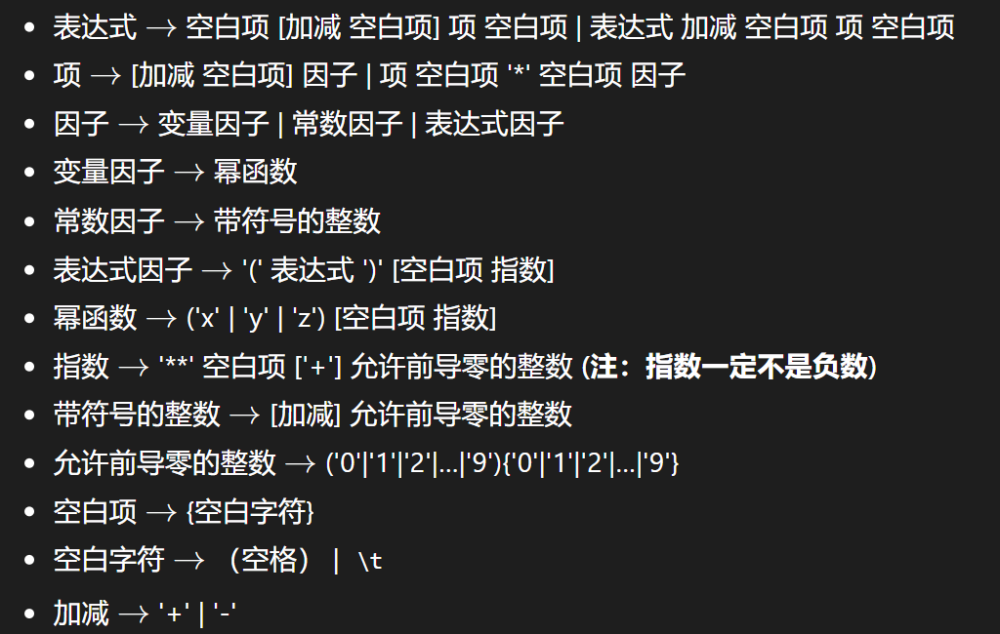
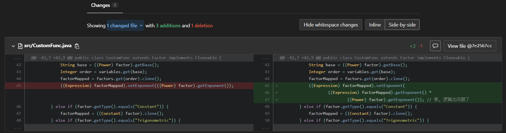
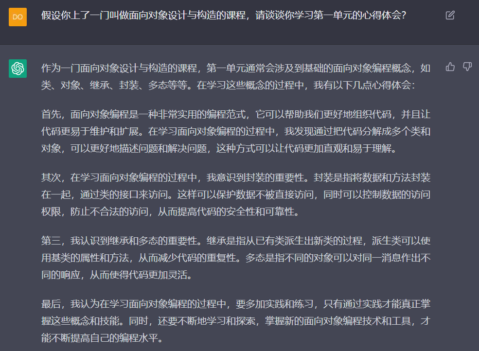

# 第一单元：表达式解析 - 面向对象设计与构造

这学期要修一门叫做面向对象设计与构造的课程。第一单元的任务是进行表达式解析，共有三次作业，一周一次。每次作业在前一次的基础上迭代开发。第四周需要写一篇博客做总结，就是你现在看到的这篇。

## 任务概览

### 作业要求

- 作业1：根据形式化定义解析输入的表达式，输出恒等变形展开括号后的表达式。
- 作业2：形式化定义加入自定义函数和三角函数。
- 作业3：形式化定义加入求导算子。

### 迭代开发难点

- 作业1：从零到一永远是最痛苦的。宏观上需要考虑类的设计，选择表达式解析的方式，猜测未来要迭代的方向；细节上需要学会正确使用正则表达式，理解运用递归下降法，使用深克隆等。如果没学过先导课我可能早就崩溃了，感恩。
- 作业1到作业2：对于自定义函数，需要对形参进行替换，很考验解析表达式的策略。对于三角函数，简单设计的话，内部相当于解析另一个独立的表达式，可以直接调用现成的方法；但是如果为了性能分缩短表达式长度，需要考虑的细节十分复杂。
- 作业2到作业3：难点在于求导的实现方法，这次迭代非常依赖前两次作业的架构。架构合适的话就会很容易——一个方法或者一个类就能实现；架构不合适的话就会很痛苦——完全重构，或者硬着头皮写下去。

## 架构设计

### 设计历程

#### 从哪入手？

我的一开始思路是严格按照题目给出的形式化定义来设计类，再严格按照形式化定义的内容解析表达式。

这样做的好处是不用费脑子，按照形式化定义一步步走就可以，而且不会出现格式问题。坏处就是很繁琐，连加减号都要建一个也太没必要了。下图展示了第一次作业的形式化定义。

所以我意识到有必要对形式化定义进行一些简化和抽象。表达式由项组成，项由因子组成，因子由幂函数、常数和表达式构成。剩下的定义就没必要再建一个类了。

#### 类保存的数据

紧接着要考虑这些类应该保存什么样的数据。

首先是类要保存的数据。我决定从数学意义的角度来思考每个类的特征。最终的目标是要获得一个没有括号的表达式，那么他应该是长这样子的：
$$
\sum_i k_ix_i^{\alpha_i}y_i^{\beta_i}z_i^{\gamma_i}
$$
这样一看就很明显了，可以初步把每个类保存的数据设计如下:

- 表达式：要保存一堆项，所以要有一个项的数组。表达式还可能作为因子，这个时候还要保存一个指数。
- 项：要保存一堆因子，所以要有一个因子的数组。项在表达式里是有一个系数的，所以要保存一个系数。
- 幂函数：幂函数可能是x，y或z，所以要保存一个字母。幂函数还有指数，所以要保存一个指数。
- 常数：就是个数。保存一个BigInteger就好。
- 因子：表达式、幂函数和常数都是因子，所以因子可以作为一个父类或接口，并不是一个"基础"的类。

#### 类实现的方法

然后要考虑这些类实现的方法。在理解递归下降时，我认为解析表达式就是向一个表达式类中添加一个一个一个项的过程。而解析项就是向一个项类中添加一个一个一个因子的过程。表达式的建立是一个动态的过程，每添加一个项就产生一个静态的表达式。所以添加项的过程，既是解析的过程，也是化简的过程。

所以初步判断每个表达式类要有一个添加项的方法，每个项类要有一个添加因子的方法。而调用这个方法的同时顺便进行了化简。

表达式和项比较复杂，交给Paser解析。幂函数和常数比较简单，可以直接看作一个token，用Lexer解析就好。

#### 后续迭代

上面都是第一次作业建立架构的流程。自认为这个架构的建立思路还是比较自然和好用的，第二次作业和第三次作业的架构建立都和第一次作业的思考过程类似。

第二次作业加入了三角函数类和自定义函数类。三角函数类和幂函数类极其类似，只不过是把幂函数里保存的x、y或z换成了一个表达式。自定义函数类和表达式类极其类似，不过要特殊标记含幂函数的项以方便替换

第三次作业加入了求导类。求导类的逻辑Parser极其类似，只不过在添加项时要替换为求导之后的项。

### 类图

想好再动笔。有了大致的方向，写代码时就不会很茫然了，只需要按照大方向前进，解决遇到的一个个小问题就可以了。

下面是最终的类图（第三次作业/矢量图）。

其中项类虽然实现的方法虽然看起来很复杂，但是大部分方法都是变种的getter和setter。

## 程序度量

下面是最终的程序度量（第三次作业）。

### 方法复杂度分析

详细表格见**附录1**. 

从表格可见，方法`CustomFunc.factorMap`和`Expression.isSame`的复杂度较高。前者是在调用自定义函数时替换形参，后者是比较两个表达式是否相同。我在实现这两个方法时都需要遍历表达式的每一项，并进行细致的比较，所以造成了较高的复杂度。为了功能的正确性这是值得的。

### 类复杂度分析

详细表格见**附录2**. 

从表格可见类`Derivator `和`Parser`的复杂度较高。在之前提过，求导类的逻辑Parser极其类似，这两者的功能都是解析出一个表达式。解析表达式时涉及到反复的递归下降，我就原谅你们复杂度很高吧。

还有一个叫做`FactorComparator`的类复杂度也很高，这是给因子排序的类。起初设计这个类是为了让输出能按照升幂或降幂输出，显得好看一点。但是最后发现太浪费时间和空间了，还会出很多bug，所以并没有在代码里实装。

### 代码行数

1290行。

## BUG分析

### 自己的BUG

在第二次作业中出现了BUG，原因是自定义函数调用发生了错误：错把实参的指数直接设置成形参的指数，而不是把两者相乘。小学数学没学好了属于是。

对代码稍作改动就可以修好这个BUG：

一次提交修好五个点，既感觉很有成就感，又生气自己太粗心了（

### 他人的BUG

第一次作业互测时发现一位同学会将`(0)**0-1`输出为`-2`，应该是处理0次幂符号时出现了问题。

第二次和第三次作业没有发现他人的BUG.

## 心得体会

在本单元的作业中，我们学习了如何用面向对象的思想去设计和实现一个多项式表达式的类。我们首先用BNF描述了多项式表达式的语法结构，并将其转化为Java类的形式，实现了多项式表达式的括号展开、函数调用以及化简等功能。

在实现多项式表达式的过程中，我们深刻体会到了层次化设计的思想，通过将表达式结构分解成若干个小的部分，并为每个小部分设计相应的类，最终将这些小的部分组合在一起，实现了一个完整的多项式表达式类。这样的设计不仅使代码的可读性更高，而且也更方便后续的扩展和修改。

此外，我们还学习了正则表达式和递归下降的解析方法，这些方法可以帮助我们更高效地解析和处理多项式表达式。正则表达式可以用于匹配字符串中的特定模式，而递归下降则可以将一个复杂的表达式逐步分解成简单的表达式，从而更容易进行处理和计算。

总的来说，本次作业让我受益匪浅，不仅提高了我的Java编程能力和面向对象设计能力，还让我了解了扩展BNF描述的形式化表述、正则表达式、递归下降等解析方法。我相信这些知识和技能在未来的工作和学习中都会对我有所帮助。

## 附录

### 附录1 方法复杂度分析

| mathod                                               | CogC              | ev(G) | iv(G)             | v(G)               |
| ---------------------------------------------------- | ----------------- | ----- | ----------------- | ------------------ |
| Constant.clone()                                     | 0.0               | 1.0   | 1.0               | 1.0                |
| Constant.Constant(BigInteger)                        | 0.0               | 1.0   | 1.0               | 1.0                |
| Constant.Constant(String)                            | 0.0               | 1.0   | 1.0               | 1.0                |
| Constant.getType()                                   | 0.0               | 1.0   | 1.0               | 1.0                |
| Constant.getValue()                                  | 0.0               | 1.0   | 1.0               | 1.0                |
| Constant.isSame(Factor)                              | 1.0               | 2.0   | 1.0               | 2.0                |
| Constant.toString()                                  | 0.0               | 1.0   | 1.0               | 1.0                |
| CustomFunc.addFactor(ArrayList)                      | 4.0               | 1.0   | 3.0               | 3.0                |
| CustomFunc.call()                                    | 0.0               | 1.0   | 1.0               | 1.0                |
| CustomFunc.clear()                                   | 0.0               | 1.0   | 1.0               | 1.0                |
| CustomFunc.clone()                                   | 0.0               | 1.0   | 1.0               | 1.0                |
| CustomFunc.CustomFunc(String[], Expression)          | 1.0               | 1.0   | 2.0               | 2.0                |
| CustomFunc.expressionMap(Expression)                 | 1.0               | 1.0   | 2.0               | 2.0                |
| CustomFunc.factorMap(Factor)                         | 17.0              | 8.0   | 8.0               | 8.0                |
| CustomFunc.getType()                                 | 0.0               | 1.0   | 1.0               | 1.0                |
| CustomFunc.termMap(Term)                             | 1.0               | 1.0   | 2.0               | 2.0                |
| CustomFuncField.addFunc(String, CustomFunc)          | 0.0               | 1.0   | 1.0               | 1.0                |
| CustomFuncField.CustomFuncField()                    | 0.0               | 1.0   | 1.0               | 1.0                |
| CustomFuncField.getFunc(String)                      | 0.0               | 1.0   | 1.0               | 1.0                |
| Debug.debug(int)                                     | 1.0               | 1.0   | 2.0               | 2.0                |
| Debug.Debug(Scanner)                                 | 0.0               | 1.0   | 1.0               | 1.0                |
| Derivator.derivativeExp(Expression, String)          | 2.0               | 1.0   | 3.0               | 3.0                |
| Derivator.derivativeFactor(Term, Factor, String)     | 15.0              | 1.0   | 6.0               | 8.0                |
| Derivator.derivativeTerm(Expression, Term, String)   | 6.0               | 4.0   | 3.0               | 4.0                |
| Derivator.mulTermCo(Term, BigInteger)                | 0.0               | 1.0   | 1.0               | 1.0                |
| Expression.addExp(Expression)                        | 2.0               | 1.0   | 3.0               | 3.0                |
| Expression.addExpTerm(Term)                          | 7.0               | 1.0   | 5.0               | 5.0                |
| Expression.addNormalTerm(Term)                       | 12.0              | 6.0   | 8.0               | 8.0                |
| Expression.addTerm(char, Term)                       | 3.0               | 1.0   | 3.0               | 3.0                |
| Expression.clone()                                   | 1.0               | 1.0   | 1.0               | 2.0                |
| Expression.Expression()                              | 0.0               | 1.0   | 1.0               | 1.0                |
| Expression.getExponent()                             | 0.0               | 1.0   | 1.0               | 1.0                |
| Expression.getFirstValidTerm()                       | 5.0               | 4.0   | 3.0               | 4.0                |
| Expression.getNum()                                  | 0.0               | 1.0   | 1.0               | 1.0                |
| Expression.getTermCnt()                              | 0.0               | 1.0   | 1.0               | 1.0                |
| Expression.getTerms()                                | 0.0               | 1.0   | 1.0               | 1.0                |
| Expression.getType()                                 | 0.0               | 1.0   | 1.0               | 1.0                |
| Expression.getValidTermCnt()                         | 3.0               | 1.0   | 2.0               | 3.0                |
| Expression.isSame(Factor)                            | 16.0              | 9.0   | 4.0               | 10.0               |
| Expression.mulExp(Expression)                        | 3.0               | 1.0   | 3.0               | 3.0                |
| Expression.setExponent(int)                          | 0.0               | 1.0   | 1.0               | 1.0                |
| Expression.toString()                                | 8.0               | 1.0   | 6.0               | 6.0                |
| Factor.Factor()                                      | 0.0               | 1.0   | 1.0               | 1.0                |
| Factor.getType()                                     | 0.0               | 1.0   | 1.0               | 1.0                |
| Factor.isSame(Factor)                                | 0.0               | 1.0   | 1.0               | 1.0                |
| FactorComparator.compare(Factor, Factor)             | 13.0              | 9.0   | 9.0               | 9.0                |
| Lexer.back()                                         | 2.0               | 1.0   | 3.0               | 3.0                |
| Lexer.getConstant(char)                              | 1.0               | 1.0   | 2.0               | 2.0                |
| Lexer.getExponent()                                  | 6.0               | 1.0   | 4.0               | 5.0                |
| Lexer.getPower()                                     | 0.0               | 1.0   | 1.0               | 1.0                |
| Lexer.Lexer(String)                                  | 0.0               | 1.0   | 1.0               | 1.0                |
| Lexer.next()                                         | 0.0               | 1.0   | 1.0               | 1.0                |
| Lexer.next(int)                                      | 4.0               | 1.0   | 3.0               | 3.0                |
| Lexer.peek()                                         | 0.0               | 1.0   | 1.0               | 1.0                |
| Main.main(String[])                                  | 0.0               | 1.0   | 1.0               | 1.0                |
| Parser.expressionParse()                             | 5.0               | 1.0   | 5.0               | 5.0                |
| Parser.factorParse()                                 | 13.0              | 1.0   | 12.0              | 13.0               |
| Parser.getArguments()                                | 3.0               | 1.0   | 3.0               | 3.0                |
| Parser.getFactorCos()                                | 3.0               | 1.0   | 2.0               | 3.0                |
| Parser.getFactorSin()                                | 3.0               | 1.0   | 2.0               | 3.0                |
| Parser.Parser(Lexer)                                 | 0.0               | 1.0   | 1.0               | 1.0                |
| Parser.Parser(Lexer, CustomFuncField)                | 0.0               | 1.0   | 1.0               | 1.0                |
| Parser.termParse()                                   | 4.0               | 1.0   | 4.0               | 4.0                |
| Power.clone()                                        | 0.0               | 1.0   | 1.0               | 1.0                |
| Power.getBase()                                      | 0.0               | 1.0   | 1.0               | 1.0                |
| Power.getExponent()                                  | 0.0               | 1.0   | 1.0               | 1.0                |
| Power.getType()                                      | 2.0               | 2.0   | 1.0               | 2.0                |
| Power.isExpanded()                                   | 0.0               | 1.0   | 1.0               | 1.0                |
| Power.isSame(Factor)                                 | 2.0               | 2.0   | 2.0               | 3.0                |
| Power.Power(String, int)                             | 0.0               | 1.0   | 1.0               | 1.0                |
| Power.setExponent(int)                               | 0.0               | 1.0   | 1.0               | 1.0                |
| Power.toString()                                     | 5.0               | 3.0   | 1.0               | 3.0                |
| Power.toStringNoExpand()                             | 2.0               | 2.0   | 1.0               | 2.0                |
| Preprocessor.analyze()                               | 4.0               | 1.0   | 3.0               | 3.0                |
| Preprocessor.getCustomFuncField()                    | 0.0               | 1.0   | 1.0               | 1.0                |
| Preprocessor.getExp()                                | 0.0               | 1.0   | 1.0               | 1.0                |
| Preprocessor.Preprocessor(Scanner)                   | 0.0               | 1.0   | 1.0               | 1.0                |
| Preprocessor.removeSpaces(String)                    | 0.0               | 1.0   | 1.0               | 1.0                |
| Simplifier.Simplifier(Expression)                    | 0.0               | 1.0   | 1.0               | 1.0                |
| Simplifier.simplify()                                | 6.0               | 4.0   | 4.0               | 4.0                |
| Term.addExpression(Expression)                       | 3.0               | 1.0   | 3.0               | 3.0                |
| Term.addFactor(char, Factor)                         | 2.0               | 1.0   | 2.0               | 6.0                |
| Term.addFactor(Factor)                               | 0.0               | 1.0   | 1.0               | 1.0                |
| Term.addPower(Factor)                                | 2.0               | 1.0   | 2.0               | 2.0                |
| Term.addTrigonometric(Trigonometric)                 | 11.0              | 4.0   | 7.0               | 7.0                |
| Term.canMergeNegTri(Term)                            | 2.0               | 2.0   | 3.0               | 3.0                |
| Term.clone()                                         | 1.0               | 1.0   | 1.0               | 2.0                |
| Term.coefficientAdd(BigInteger)                      | 0.0               | 1.0   | 1.0               | 1.0                |
| Term.coefficientMul(BigInteger)                      | 0.0               | 1.0   | 1.0               | 1.0                |
| Term.coefficientNeg()                                | 0.0               | 1.0   | 1.0               | 1.0                |
| Term.getCoefficient()                                | 0.0               | 1.0   | 1.0               | 1.0                |
| Term.getExpFactorCnt()                               | 0.0               | 1.0   | 1.0               | 1.0                |
| Term.getFactor(String)                               | 0.0               | 1.0   | 1.0               | 1.0                |
| Term.getFactors()                                    | 0.0               | 1.0   | 1.0               | 1.0                |
| Term.getFactorsSorted()                              | 0.0               | 1.0   | 1.0               | 1.0                |
| Term.getType()                                       | 0.0               | 1.0   | 1.0               | 1.0                |
| Term.isContainOnlyTri()                              | 1.0               | 1.0   | 2.0               | 2.0                |
| Term.isExpTerm()                                     | 0.0               | 1.0   | 1.0               | 1.0                |
| Term.isMarked()                                      | 0.0               | 1.0   | 1.0               | 1.0                |
| Term.isMergeableTriToConst(Term)                     | 3.0               | 2.0   | 3.0               | 3.0                |
| Term.isOnlyConstant()                                | 0.0               | 1.0   | 1.0               | 1.0                |
| Term.isOnlyPower()                                   | 2.0               | 1.0   | 5.0               | 5.0                |
| Term.isOnlyTrigonometric()                           | 1.0               | 1.0   | 3.0               | 3.0                |
| Term.isPowerExpanded()                               | 0.0               | 1.0   | 1.0               | 1.0                |
| Term.isSame(Term)                                    | 9.0               | 6.0   | 3.0               | 6.0                |
| Term.mark()                                          | 0.0               | 1.0   | 1.0               | 1.0                |
| Term.mulTerm(Term)                                   | 2.0               | 1.0   | 3.0               | 3.0                |
| Term.setCoefficient(BigInteger)                      | 0.0               | 1.0   | 1.0               | 1.0                |
| Term.sort()                                          | 0.0               | 1.0   | 1.0               | 1.0                |
| Term.Term()                                          | 0.0               | 1.0   | 1.0               | 1.0                |
| Term.toString()                                      | 8.0               | 1.0   | 6.0               | 6.0                |
| Term.toStringNoExpand()                              | 4.0               | 1.0   | 5.0               | 5.0                |
| Trigonometric.clone()                                | 1.0               | 1.0   | 1.0               | 2.0                |
| Trigonometric.getExponent()                          | 0.0               | 1.0   | 1.0               | 1.0                |
| Trigonometric.getFactor()                            | 0.0               | 1.0   | 1.0               | 1.0                |
| Trigonometric.getType()                              | 0.0               | 1.0   | 1.0               | 1.0                |
| Trigonometric.getTypeFunc()                          | 0.0               | 1.0   | 1.0               | 1.0                |
| Trigonometric.isMergeableToConst(Trigonometric)      | 1.0               | 1.0   | 4.0               | 4.0                |
| Trigonometric.isNeg(Factor)                          | 8.0               | 6.0   | 4.0               | 6.0                |
| Trigonometric.isSame(Factor)                         | 3.0               | 4.0   | 1.0               | 4.0                |
| Trigonometric.isSame(Trigonometric)                  | 1.0               | 2.0   | 1.0               | 2.0                |
| Trigonometric.setExponent(int)                       | 0.0               | 1.0   | 1.0               | 1.0                |
| Trigonometric.toString()                             | 14.0              | 1.0   | 9.0               | 9.0                |
| Trigonometric.Trigonometric(String, Expression, int) | 1.0               | 1.0   | 2.0               | 2.0                |
| Total                                                | 267.0             | 186.0 | 267.0             | 304.0              |
| Average                                              | 2.153225806451613 | 1.5   | 2.153225806451613 | 2.4516129032258065 |

### 附录2 类复杂度分析

| class            | OCavg              | OCmax  | WMC    |
| ---------------- | ------------------ | ------ | ------ |
| Constant         | 1.1428571428571428 | 2.0    | 8.0    |
| CustomFunc       | 2.3333333333333335 | 8.0    | 21.0   |
| CustomFuncField  | 1.0                | 1.0    | 3.0    |
| Debug            | 1.5                | 2.0    | 3.0    |
| Derivator        | 4.25               | 9.0    | 17.0   |
| Expression       | 3.0                | 9.0    | 51.0   |
| Factor           | 1.0                | 1.0    | 3.0    |
| FactorComparator | 9.0                | 9.0    | 9.0    |
| Lexer            | 2.0                | 4.0    | 16.0   |
| Main             | 1.0                | 1.0    | 1.0    |
| Parser           | 3.25               | 10.0   | 26.0   |
| Power            | 1.5                | 3.0    | 15.0   |
| Preprocessor     | 1.4                | 3.0    | 7.0    |
| Simplifier       | 2.5                | 4.0    | 5.0    |
| Term             | 1.9375             | 7.0    | 62.0   |
| Trigonometric    | 2.25               | 6.0    | 27.0   |
| Total            |                    |        | 274.0  |
| Average          | 2.2096774193548385 | 4.9375 | 17.125 |

### 附录3 我觉得它说的比我好

