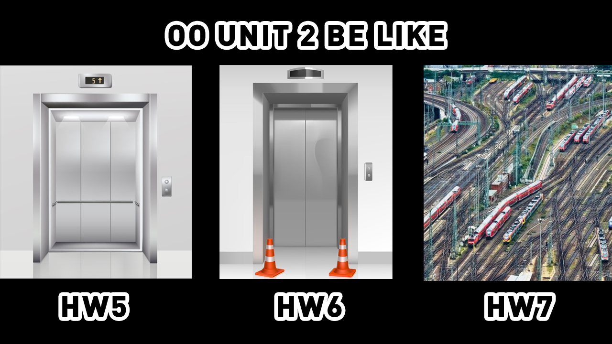
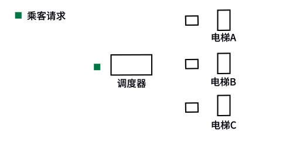
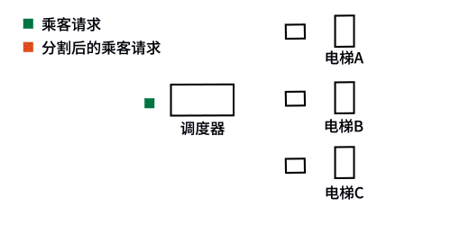
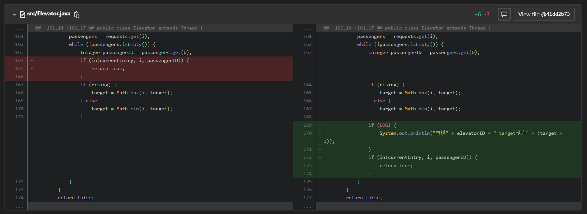

# 第二单元：模拟多电梯系统 - 面向对象设计与构造

---

[TOC]

---

第二单元的任务是模拟一个多电梯系统，共有三次作业，一周一次。每周的作业在上一周的基础上迭代开发。第四周需要写一篇博客做总结，就是现在这篇。

本单元的目标是在不断魔改电梯系统的过程中，逐渐熟悉多线程编程。

## 任务概览

### 作业要求

- hw5: 模拟一个简单的可稍带乘客的多电梯系统。
- hw6: 支持电梯的增减、支持更换电梯参数。
- hw7: 限制电梯可达性、限制每层电梯同时工作个数。

其中hw7给人的感觉就像：

### 迭代开发难点

- hw5: 

  代码实现方面有两个难点：线程同步、电梯调度。线程同步需要掌握生产者-消费者模式和wait-notify方法，电梯调度需要尽可能捎带乘客。

  设计架构时有一个难点：猜测未来迭代的方向，这直接关乎未来的迭代体验。一个比较自然的猜测是出题人会在电梯的参数上做文章：电梯个数、电梯升降时间、电梯可达楼层等。这恰好是hw6和hw7要支持的内容。

- hw6: 

  难点在于电梯维护后对乘客请求的重分配。如果把电梯看作消费者，调度器看作生产者的话，这就需要消费者把乘客吐回给生产者，生产者再把乘客吐给另一个消费者。直接颠覆食物链能量流动方向了属于是。

- hw7:

  难点在于满足可达性限制，并作出路径规划。如果出现需要换乘的请求，就不得不再开一个线程专门负责这个请求。

  同时由于在hw6中支持了删减电梯（维护电梯），如果一个需要换乘的乘客被吐出来了，还要再次重新规划路径，再次重新分配乘客。此时的电梯系统更像一个地铁系统，或者说一个物流系统。

## 设计与实现

整体架构直接借鉴了单元训练里的生产者-消费者模型。调度器是生产者，各个电梯是消费者。每个电梯都有一个“盘子”，用来和调度器交换乘客请求。

在我的架构中，电梯接收到请求后会自动根据写好的捎带算法开始运行。在迭代时，只需要考虑如何分发和转发乘客请求就可以了。

因此我本单元的主要精力都放在了乘客请求的分发与转发上，下面着重介绍这部分的设计。

### 调度器：乘客请求的分发与转发

在hw5中，只需要简单的分发乘客请求即可。乘客请求每三个为一组，以组为单位，逐个分配到电梯中。三个为一组既能发挥电梯捎带的优势，又能降低电梯满载的概率，也能减少电梯不必要的运动。这种分配方法很容易写，也很容易改。

在hw6中，需要支持电梯维护。如果电梯维护时有尚未处理的请求，则电梯将乘客请求吐回给调度器重新分配。

下图中调度器先向电梯A分配了三个请求，但三个请求尚未处理完，电梯A便进入了维护。此时电梯A将请求吐回给调度器，调度器更新请求的起始楼层，重新吐给其它可用的电梯。

在hw7中，如果调度器在路径规划时发现需要换乘，则将需要换乘的请求分割为若干个子请求。此时调度器会新开一个子调度器线程，按照时序逐个发送子请求至对应电梯。

至此便完成了本单元的核心架构设计。如果未来还需要对架构进行扩展的话，估计仍需要在乘客请求的转发和分发上进行迭代。

### 实现细节：锁与同步块、算法、技巧

1. 三次作业中使用的锁都是电梯和调度器之间的“盘子”，即乘客请求队列。在hw7中，额外使用了semaphore来实现电梯同时工作数量的限制。在调度器分发乘客请求、电梯获取乘客请求时，需要获取请求队列锁；电梯开门时需要获取semaphore锁，关门时释放semaphore锁。

1. 电梯内部运行使用的是LOOK算法。当电梯每到达一个新的楼层时，会根据“盘子”里的内容（即乘客请求队列）更新自己的目标楼层，同时检测当前楼层是否需要捎带或放人。

2. 在hw5、hw6中，电梯会在向上或向下移动前再判断是否需要关门，而不是在接人和放人之后立刻关门。这样可以避免在同一楼层多次开关门，提高效率。

   但是在hw7中，由于限制了同时处于开门状态的电梯数目，不得不及时关门以保护效率。

3. 调度器规划路径使用的是以楼层为单位的广度优先搜索。从乘客的目标层开始搜索，一直递归搜索到乘客的起始层，可以确保找到换乘次数最少的路线。

4. 使用栈来储存分割后的乘客请求。子调度器在发送一个请求后会进入wait状态，电梯处理完相应请求后会notify子调度器，此时子调度器被唤醒，从栈中弹出下一个请求发送至对应电梯。

这些地方我的实现都很平凡，就不细写了。

### 类图

类图如下（矢量图）。

### 协作图

协作图如下（矢量图）。

## BUG分析

### 在线评测

本单元在强测和互测中没有出现bug。

### 本地测试

但是在hw6本地测试时，发现了一个从hw5就存在却一直没有被发现的bug。这个bug的触发条件是：

> 在电梯运动到自己的目标层时，恰好接收到了最后一个乘客请求，且这个请求恰好使得电梯满载，且`该乘客的目标楼层与电梯当前位置的距离`恰好大于`电梯的目标楼层与电梯当前位置的距离`时，电梯会误以为已经处理完了所有请求，从而停止更新自己的目标楼层，从而使得最后一个乘客无法到达目的地。

这个是我在用评论区的评测机时，在一次测试中设置了远超数据限制的请求，才发现了这个bug。触发条件真的很苛刻...

由衷感谢公开评测机的大佬们，您们拯救了我的oo作业，我看到互联网精神在6系上空冉冉升起，respect😭🙏

解决办法是调换某个代码段的顺序即可：

## 作业得分

|  hw5  |  hw6  |  hw7  |
| :---: | :---: | :---: |
| 98.73 | 96.93 | 93.89 |

性能一次比一次差。无所谓，能跑就行（

## 心得体会

在学习多线程编程这一单元的过程中，我通过三次作业的实践，对于多线程的创建、运行、安全、协同等方面有了更深刻的理解和体验。

在hw5中，我学会了如何创建和启动线程，如何使用锁来保证线程安全，如何使用条件变量进行线程之间的协同。我通过模拟电梯的运行过程，更深刻地理解了线程之间的并发和同步的概念，以及如何解决线程安全问题。

在hw6中，我进一步学习了线程安全知识，掌握了如何使用信号量、读写锁等多种锁机制来保证线程安全，同时，我也学会了如何在架构层面上进行设计，通过将不同层次的功能模块拆分成不同的线程来实现更加灵活的程序设计。

在hw7中，我进一步学会了如何在不同线程之间进行交互，如何使用消息队列、共享内存等机制来实现线程之间的协同。我也掌握了如何通过事件驱动的方式来实现线程之间的通信，以及如何设计消息的格式和传递方式来确保线程之间的正确协同。

通过这三次作业的实践，我不仅掌握了多线程编程的基本技能，也深入理解了线程之间的并发、同步、安全、协同等概念和机制。同时，我也学会了如何在程序设计中，考虑线程的并发和协同性，实现更加高效和层次化的程序设计。这对于我今后的编程工作和学习都有着很大的帮助。
