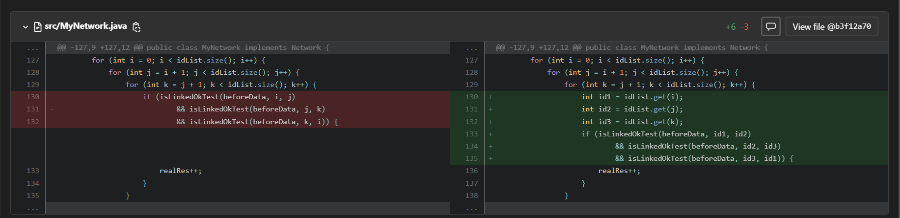

# 第三单元：规约语言与算法 - 面向对象设计与构造

---

[TOC]

---

第三单元的任务是学习契约式设计，并根据规约语言JML编写程序。共有三次作业，一周一次，每周的作业在上一周的基础上迭代开发。第四周需要写一篇博客做总结，就是现在这篇。

## > 作业要点

- hw9: 建立一张无向带权图，支持查询连通块、三元环个数。
- hw10: 支持修改边权（包括删除边），支持将顶点分组并按组修改边权。
- hw11: 支持查询过一点的最短环路。

此外，每次作业都需要根据规格编写一个测试函数。指导书将这种测试函数称为“OK测试”。


*你说得对，但是unit3更加重视对规格的理解，而在算法层面有所减弱。*


## > 设计与实现

### >> 架构设计

本单元不太需要自己设计架构，JML已经规定好了一个较为完整的架构。

本单元的问题实际上是图论问题。类比大一的程序设计和数据结构，`Person`类就是图的顶点。图的储存方式其实是链表法，`Person`类中的`Acquaintance`似于c语言中用链表储存相邻节点。

所需要的数据结构在Java中很容易实现，这就不得不提到`HashMap`了。


### >> 算法实现：HashMap为什么是神？

`HashMap`为什么是神？在谈论这个问题之前，我想先说说其他容器相较于`HashMap`究竟差在了哪里。

首先是犯下傲慢之罪的静态数组。以为自己开的够大就露出不屑的笑，这种傲慢的数组注定走不长远。事实也是如此，静态数组在算法竞赛中称霸后就一直在走下坡路，最终MLE。

然后是犯下愤怒之罪的`ArrayList`. 因为有人说查询要`O(n)`就跟人家打架，程序里有人提到神的名字就怒气冲冲地打出自己的名字。于是神降下了他的惩罚，`ArrayList`一直TLE，从此一蹶不振。

最后是犯下嫉妒之罪的`LinkedList`. 屡次被神击败，但口服心不负的`List`，总是嫉妒着神，暗戳戳地把自己存数据的方法改成了链表。然而这改变不了查询仍然需要`O(n)`的事实。于是，在无数的查询指令面前，`LinkedList`被神正面击溃。

现在我们来谈谈神为什么是神，神为什么凌驾于其他容器之上，以及在他身上究竟有哪些美德值得我们去学习。

首先是神的忠诚。最优情况下，`HashMap`的查询复杂度为`O(1)`！

然后是神的节制。最优情况下，`HashMap`的插入复杂度为`O(1)`！

最后是神的谦逊。最优情况下，`HashMap`的删除复杂度为`O(1)`！

于是，在`Network`类中，所有的元素都被放入了`HashMap`: 

```Java
    private HashMap<Integer, Group> id2Group;
    private HashMap<Integer, Message> id2Message;
    private HashMap<Integer, HashSet<Group>> personId2Group;
    private HashMap<Integer, Integer> emojiId2Heat;
```

于是，在`Person`类中，所有的`Acquaintance`都被放入了`HashMap`: 

```Java
	private HashMap<Person, Integer> acquaintances = new HashMap<>();
```

于是，在异常计数中，所有的异常记录都被放入了`HashMap`:

```Java
public class Counter {
    public static final Counter COUNTER = new Counter();
    private int pinf = 0;
    private HashMap<Integer, Integer> pinfId;
    private int epi = 0;
    private HashMap<Integer, Integer> epiId;
	...
```

于是，在`Group`类中，所有的顶点都被放入了`HashMap`: 

```Java
    private HashMap<Integer, Person> id2Person;
```

甚至，当人们需要并查集时，所有的顶点也都被放入了`HashMap`:

```Java
	private HashMap<Person, Integer> person2Block;
	private HashMap<Integer, HashSet<Person>> block2Persons;
```

甚甚至，当人们需要迪杰斯特拉时，所有的顶点也都被放入了`HashMap`:

```Java
	HashMap<Person, Integer> dijkstra(Person root) {
        PriorityQueue<Node> queue = new PriorityQueue<>();
        HashSet<Person> unsolved = new HashSet<>();
        HashMap<Person, Integer> solved = new HashMap<>();
		...
```

这样的神怎么能不被大家爱戴呢？


### >> 规格与实现分离

契约式设计是一种软件设计方法，它将程序中的规格（契约）与实现（代码）分离开来。在契约式程序设计中，规格是描述组件、函数或类的预期行为的明确约定，而实现是代码的具体实现细节。

规格与实现分离的理念可以带来以下几个优点：

1. **清晰的接口定义**：通过将规格与实现分离，可以明确地定义组件或函数的接口，包括输入、输出、预期行为和约束条件。这使得使用组件的开发人员能够清楚地了解如何正确地使用它们，而无需深入了解实现的细节。
2. **解耦合和模块化**：规格与实现分离有助于解耦合组件之间的依赖关系。组件的使用者只需要关注规格中定义的接口，而不需要了解底层的实现细节。这种解耦合促进了模块化开发，使得更容易修改、替换或扩展组件而不会对整个系统造成不必要的影响。
3. **可重用性**：通过明确定义组件的规格，可以使其更具通用性和可重用性。规格描述了组件的功能和行为，而实现则是具体实现该功能和行为的代码。这种分离使得规格可以独立于实现进行重用，从而提高了代码的可维护性和可扩展性。
4. **测试和验证**：规格提供了一种明确的方式来定义组件的预期行为。通过将规格与实现分离，可以更容易地编写测试用例，验证组件是否满足规格中定义的约束条件和行为要求。这样可以提高代码的可靠性和质量。

总而言之，规格与实现分离是契约式程序设计中的关键思想，它通过明确规定组件的规格和行为，将接口与实现解耦合，从而提高代码的可重用性、可维护性和可扩展性。


### >> OK测试

在契约式设计中，严格按照规格编写的测试函数对于检验代码实现与规格的一致性起到至关重要的作用。在本单元指导书中，将这样的测试函数称为"OK测试"。以下是OK测试在检验代码实现与规格一致性方面的作用：

1. **验证契约条件**：规格定义了组件的预期行为和约束条件。通过编写契约测试，可以验证代码是否满足规格中定义的契约条件。
2. **检测实现错误**：OK测试是对规格的直接验证，通过执行OK测试可以检测实现中的错误。如果代码在某个规格条件下未能满足规格中定义的行为，OK测试将失败，从而帮助开发人员快速发现并修复实现中的错误。
3. **促进规格更新**：当规格发生变化时，OK测试能够帮助确保代码的实现与新规格保持一致。通过更新OK测试，可以捕捉到代码与规格之间的不一致性，帮助开发人员及时调整代码以适应新规格。
4. **提供文档和示例**：OK测试本身可以作为规格的文档和示例。通过查看OK测试，开发人员和其他利益相关者可以更好地了解规格中定义的契约条件和预期行为。这有助于确保代码的实现与规格一致，并为其他开发人员提供使用组件的示例。
5. **保证接口兼容性**：在契约式设计中，组件之间的接口是通过规格来定义的。OK测试可以验证组件之间的接口是否兼容，即确保一个组件的实现符合另一个组件的预期行为。这有助于减少在组件之间集成时的兼容性问题，确保各个组件能够正确地协同工作。


## > 软件测试

[软件测试](https://zh.wikipedia.org/zh-hans/%E8%BD%AF%E4%BB%B6%E6%B5%8B%E8%AF%95)是指在软件开发过程中使用各种技术和工具对软件系统进行评估和验证的过程。它的目标是发现潜在的错误、缺陷或问题，并确保软件系统符合预期的质量标准和用户需求。

### >> 黑白箱测试

黑箱测试和白箱测试是软件测试中两种不同的方法。

黑箱测试（Black Box Testing）是一种测试方法，它关注于测试系统的功能和行为，而不考虑系统的内部结构和实现细节。测试人员在黑箱测试中没有访问代码、设计文档或内部知识，他们只关注于输入和输出之间的关系，以验证系统是否按照预期运行。黑箱测试侧重于检查软件是否符合规格说明、用户需求和预期功能。

白箱测试（White Box Testing），也被称为透明盒测试或结构测试，是一种测试方法，它关注于测试系统的内部结构、设计和实现细节。测试人员在白箱测试中可以访问代码、设计文档和内部知识，他们使用这些信息来设计和执行测试用例，以验证系统的内部逻辑是否正确。白箱测试侧重于覆盖代码路径、检查边界条件和错误处理机制，以确保软件在技术层面上是正确的。

### >> 测试阶段

- 单元测试（Unit Testing）：单元测试是对软件中最小的可测试单元（如函数、方法或类）进行测试的过程。它的目标是验证这些单元的行为是否符合预期，并尽早发现和修复可能的问题。
- 功能测试（Functional Testing）：功能测试是一种测试方法，用于验证软件系统的功能是否按照规格说明和用户需求正常工作。它关注于系统的功能和行为，而不考虑内部实现细节。
- 集成测试（Integration Testing）：集成测试是在多个组件或模块结合在一起形成系统之后进行的测试过程。它的目标是验证这些组件之间的接口和交互是否正常，并确保它们在集成后能够正确地工作。
- 压力测试（Stress Testing）：压力测试是一种测试方法，用于评估系统在负载增加和极限条件下的性能表现。它通过模拟大量并发用户或大数据量的负载来测试系统的稳定性、吞吐量和响应时间。
- 回归测试（Regression Testing）：回归测试是在对软件进行更改或修复后重新执行旧的测试用例，以确保新的更改没有引入新的错误或导致现有功能发生问题。它的目标是验证软件在进行修改后仍然保持正常的功能和行为。

### >> 测试工具

`画图`，`记事本`，`diff命令`.

每次看到佬们的评测机，都感觉佬们正在用尖端科技改变世界，而我还在丛林里钻木取火（

### >> 数据构造策略

数据构造是软件测试中一个重要的任务，它涉及生成测试数据以满足测试需求和覆盖测试目标。以下是一些常见的数据构造策略：

1. 正常值测试：使用符合预期范围和规格要求的正常数据进行测试。这些数据可以代表典型的使用情况，以验证系统在正常条件下的功能和性能。
2. 边界值测试：在测试数据中选择接近或恰好位于边界值的数据，包括最小值、最大值和临界值。边界值测试可以揭示在边界处可能出现的问题和错误。一个典型的例子是hw10强测中的`hw10_strong_1111.txt`.
3. 异常值测试：使用非预期或无效的数据进行测试，包括错误的格式、无效的输入和异常情况。这可以帮助发现系统对异常情况的处理能力和错误处理机制。异常值测试对应本单元作业中的一系列异常类。
4. 随机化测试：使用随机生成的数据进行测试，以模拟真实世界中的各种情况和场景。随机化测试可以帮助发现常见的错误和异常情况。
5. 组合测试：将不同的输入参数组合在一起进行测试，以测试系统对不同参数组合的相互作用和影响。这可以帮助发现参数之间的依赖关系和潜在的冲突。


## > BUG分析

hw9的“OK测试”编写有误，错把数组下标用作了人物id。

并且在自己构造数据时，人物id偷懒直接用了`1 2 3 4 5 ...`，所以测试时没发现这个bug。生吃个人我很抱歉



| hw9  | hw10 | hw11 |
| :--: | :--: | :--: |
|  90  | 100  | 100  |


## > 学习体会

在这个单元中，我学习了JML规格的理解与实现，并应用它们来完成社交关系模拟系统的开发任务。这个单元的学习使我对JML规格的重要性和应用有了更深入的认识，并且提升了我的代码质量意识和能力。

通过学习JML规格，我意识到规格在软件开发中的关键作用。规格定义了组件的预期行为、约束条件和接口要求，能够明确地描述出组件应该如何正确使用和与其他组件交互。这为开发过程提供了清晰的指导，减少了开发人员对实现细节的依赖，提高了代码的可维护性和可扩展性。

在实际实现社交关系模拟系统的任务中，我遵循了JML规格的编写原则，将规格作为代码的一部分来定义，并编写相应的JML注解。通过编写规格和JML注解，我明确了系统中各个模块、类和方法的功能、输入输出、前置条件和后置条件等方面的要求，为代码实现提供了明确的目标。

通过与规格的对比和测试，我能够更准确地验证代码实现与规格的一致性，发现潜在的问题和错误。特别是在进行契约测试时，规格起到了重要的作用，帮助我验证代码的正确性、接口的兼容性，并及时调整代码以适应新的规格要求。

此外，学习JML规格也让我在面向对象设计与构造中意识到规格的重要性。通过合理地定义和使用规格，可以减少类之间的耦合度，提高类的可重用性和可测试性。规格不仅仅是一种文档或注释，更是一种对代码设计的思考和约束，能够帮助我更好地设计和构造高质量的代码。

总的来说，通过学习和实践JML规格，我深刻理解了规格在软件开发中的重要性和价值。它不仅能提高代码的可维护性和可测试性，还能促进团队协作和代码重用。我相信在今后的软件开发中，我将更加注重规格的编写和应用，以提高代码质量和开发效率。
