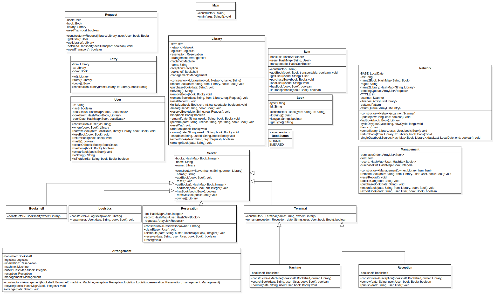
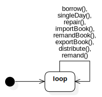
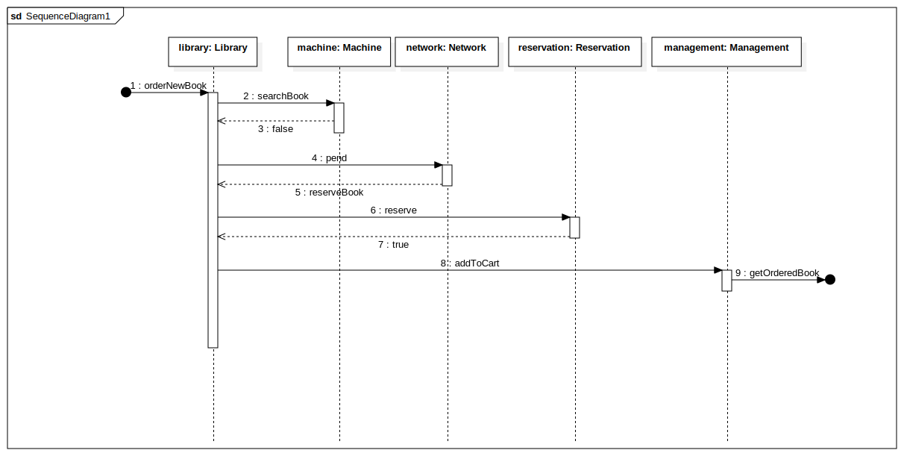

# 第四单元：UML建模与课程总结 - 面向对象设计与构造

再见了，所有的oo作业。

---

[TOC]

---

## UML建模与开发

本单元所实践的UML建模与开发旨在通过图书馆模拟系统示例，锻炼学生在程序架构设计和抽象能力方面的能力，并加强对UML图的绘制训练。以下是本单元所实践的主要步骤和方法：

1. 需求分析：首先，对图书馆模拟系统进行需求分析，确定系统的功能和行为。这包括借书、还书、管理图书和用户等方面的需求。通过详细的需求分析，可以确保对系统需求的全面理解。
2. 类图设计：根据用例图和需求分析结果，设计类图来表示系统的静态结构。类图包括各种类、属性、方法以及它们之间的关系。在图书馆模拟系统中，可能会有书籍类、用户类、管理员类等。通过设计类图，可以准确地描述系统中的对象及其之间的关联。
3. 状态图设计：对于具有状态的对象，如借书记录或用户状态，可以设计状态图来表示对象状态的转换和行为。状态图可以展示对象在不同状态之间的转换条件和操作。例如，借书记录的状态可以包括借出、归还、逾期等，通过状态图可以清晰地描述状态之间的转换过程。
4. 顺序图设计：在设计顺序图时，关注系统中不同对象之间的交互和消息传递顺序。通过顺序图，可以更清晰地描述借书和还书等操作的过程。顺序图展示了对象之间的交互顺序和消息传递路径，有助于理解系统中各个对象之间的协作方式。

通过以上步骤和方法，我们可以全面理解系统的需求和结构，并能够使用UML图表来进行系统的正向建模和开发。这有助于提高我们的设计能力、抽象能力和对系统架构的理解。同时，通过图书馆模拟系统的实践，我们能够将理论知识应用于实际项目，培养解决问题和合作开发的能力，为将来的软件开发工作打下坚实的基础。

## 架构设计

### 类图

类图与程序能互相找到名字相同的类；类图中的 继承、实现、关联 关系应和代码实现中的关系保持一致；类图中的每个类拥有的属性和方法，与程序中对应类的属性和方法一致。

### 状态图

转圈圈

### 顺序图

对于需求中给定的场景，顺序图中应存在相应的消息路径来实现该场景；Lifeline 与代码中的某个类名称相同；

除 reply message 外，任何一个 message 的名称应与 target 所对应类的某个方法相同；如果 source 和 target 所对应的类不同，相应方法不能为 private；任何一个 message 的 source 和 target 所对应的两个类之间应有关联关系。

## 课程总结

### 架构设计思维的演进

在第一单元中，我开始接触和理解层次化设计的思想。通过对表达式结构进行建模，我学会了如何使用适当的模型和层次结构来表示复杂的多项式表达式，并实现括号展开、函数调用和化简等功能。这个过程中，我意识到模块化设计的重要性，将复杂的问题分解成更小的组成部分，以提高代码的可读性和可维护性。

在第二单元中，我们进行了多线程实时电梯系统的设计。在这个过程中，我进一步加强了对层次架构设计的理解和运用。我需要考虑多个线程之间的交互和协同，将电梯系统划分为不同的模块，并设计合适的接口和通信机制。通过这个单元的实践，我学会了将系统按照功能划分成多个模块，通过合理的模块间交互，实现复杂系统的设计和开发。

在第三单元中，我们致力于实现社交关系系统中不同消息类型以及相关操作。这个单元的学习目标是理解JML规格在面向对象设计与构造中的重要意义，并掌握利用JML规格提高代码质量的能力。通过定义和使用JML规格来描述类的行为和约束，我更加注重规格和约束的定义和使用，通过规范化的方式来设计和构造系统，以提高代码的质量和可靠性。

在第四单元中，我们以图书馆模拟系统为例，锻炼了我们在程序架构的设计和抽象能力。通过这个单元的实践，我将架构设计和抽象能力应用于实际的程序开发中。我学会了使用UML图来进行系统的正向建模，并通过图书馆模拟系统的设计，培养了我的设计能力、抽象能力和对系统架构的理解。这个过程中，我意识到良好的架构设计能够提高代码的可维护性和扩展性，为将来的软件开发工作打下了坚实的基础。

### 测试思维的演进

第一单元：在表达式结构建模的单元中，我开始了解测试在软件开发中的重要性。我学会了编写针对多项式括号展开、函数调用和化简等功能的测试用例。通过测试用例的设计和执行，我能够验证代码的正确性，并发现潜在的问题和错误。

第二单元：在多线程实时电梯系统的单元中，我进一步加强了对测试思维的认识。由于多线程系统的复杂性，我学会了设计针对不同线程交互和协同的测试用例。通过模拟电梯系统的运行场景，我能够检查系统的并发性、同步性和正确性，确保系统能够按照预期进行运行。

第三单元：在社交关系系统的单元中，我对测试思维的重要性有了更深入的认识。我学习了如何使用JML规格来定义和验证类的行为和约束。通过编写JML规格的测试用例，我能够确保代码符合规范并满足预期的功能和性能要求。这个过程中，我开始注重测试的全面性和覆盖率，以及对代码中可能存在的边界情况进行测试。

第四单元：在图书馆模拟系统的单元中，我将测试思维应用到了系统架构的设计中。通过对系统的各个模块进行测试，我能够验证模块之间的交互和功能的正确性。我学会了编写集成测试用例，确保系统的各个部分能够协同工作，并按照预期的方式运行。此外，我也开始关注性能测试和安全性测试等方面，以确保系统在各种场景下都能够正常运行。

通过这四个单元的学习和实践，我的测试思维逐渐从简单的功能测试扩展到并发性、规范性、集成性和性能等方面的测试。我意识到测试是软件开发过程中不可或缺的一部分，能够帮助我发现问题、改进代码，并提供可靠的软件解决方案。我将继续不断提升测试思维，以确保我开发的软件具有高质量、可靠性和可维护性。

### 课程收获

在这几个单元的课程学习中，我有以下收获：

1. 系统设计和抽象能力的提升。
2. UML图的绘制能力的提高。
3. 架构设计思维的培养。
4. 测试思维和质量意识的增强。
5. 团队合作和沟通能力的提升。

这些收获不仅增强了我的技术能力，还培养了解决问题和有效沟通的能力，为我的职业发展奠定了坚实的基础。