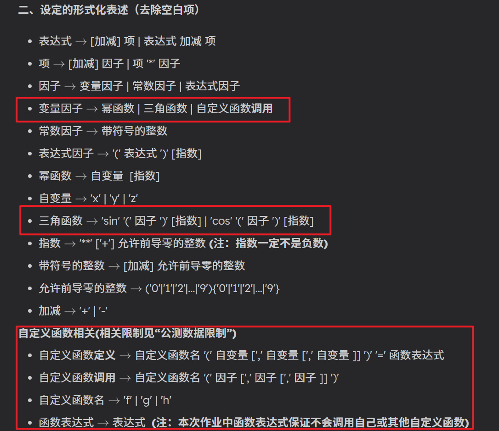

带高亮：

#### 二、设定的形式化表述（去除空白项）

* 表达式 $\rightarrow$ [加减] 项 | 表达式 加减 项 
* 项 $\rightarrow$ [加减] 因子 | 项 '\*' 因子
* 因子 $\rightarrow$ 变量因子 | 常数因子 | 表达式因子
* 变量因子 $\rightarrow$ 幂函数 | 三角函数 | 自定义函数**调用** 
* 常数因子 $\rightarrow$ 带符号的整数
* 表达式因子 $\rightarrow$ '(' 表达式 ')' [指数]
* 幂函数 $\rightarrow$ 自变量  [指数]
* 自变量 $\rightarrow$ 'x' | 'y' | 'z'
* 三角函数 $\rightarrow$ 'sin' '(' 因子 ')' [指数] | 'cos' '(' 因子 ')' [指数]
* 指数 $\rightarrow$ '\*\*' ['+'] 允许前导零的整数 **(注：指数一定不是负数)**
* 带符号的整数 $\rightarrow$ [加减] 允许前导零的整数
* 允许前导零的整数 $\rightarrow$ ('0'|'1'|'2'|…|'9'){'0'|'1'|'2'|…|'9'}
* 加减 $\rightarrow$ '+' | '-'

**自定义函数相关(相关限制见“公测数据限制”)**

* 自定义函数**定义** $\rightarrow$ 自定义函数名 '(' 自变量 [',' 自变量 [',' 自变量 ]] ')' '=' 函数表达式
* 自定义函数**调用** $\rightarrow$ 自定义函数名 '(' 因子 [',' 因子 [',' 因子 ]] ')'
* 自定义函数名 $\rightarrow$ 'f' | 'g' | 'h'
* 函数表达式 $\rightarrow$ 表达式  **(注：本次作业中函数表达式保证不会调用自己或其他自定义函数)**